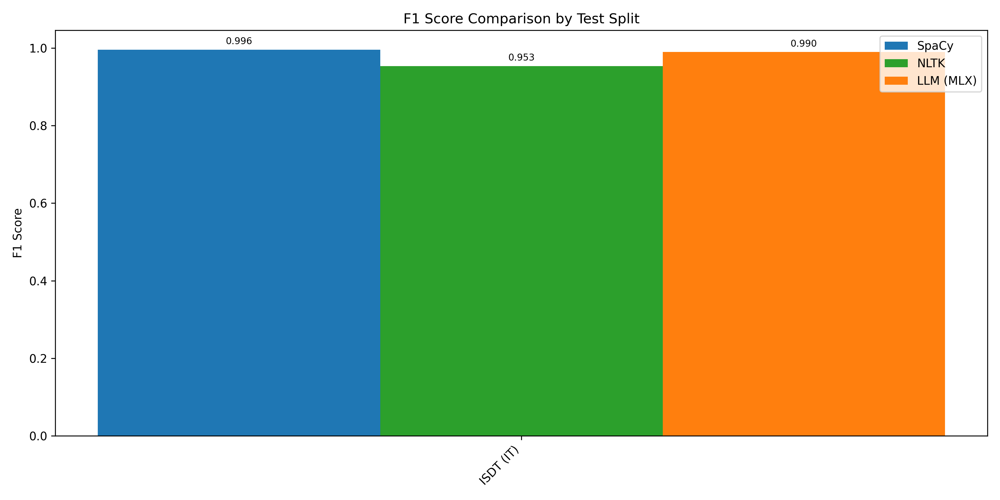

# Sentence Splitter (Token-Level MoE Architecture)

A high-performance, token-level sentence boundary detection system. This repository leverages Large Language Model (LLM) embeddings combined with a Mixture of Experts (MoE) classifier and a Multi-Scale Convolutional Neural Network (CNN) to achieve state-of-the-art accuracy across diverse linguistic domains—from formal text to noisy social media content.

---

## 🚀 Key Features

- **Advanced LLM Backend**: Uses embeddings from `Qwen3.5-0.8B` or `Qwen2.5-0.5B` to capture deep semantic and syntactic context, making it extremely robust to missing or unconventional punctuation.
- **Mixture of Experts (MoE)**: Features an efficient routing mechanism where specialized neural experts handle different linguistic edge cases.
- **Multi-Scale CNN**: Captures local punctuation patterns (e.g., periods), medium-scale abbreviations (e.g., "Mr.", "St."), and large separators (e.g., quotes, newlines).
- **Apple Silicon Optimized**: Fully supports `mlx` hardware acceleration alongside traditional `transformers` (PyTorch) execution.
- **Memory-Efficient Training**: Implements offline embedding extraction and memory-mapping (`mmap=True`) for datasets, allowing training without exhausting RAM.
- **Domain Adaptability**: Includes specialized fine-tuning scripts to balance performance across diverse and challenging datasets using Macro-F1 strategies.

---

## 🧠 Neural Architecture

The detection pipeline transitions from dense, contextualized LLM representations to lightweight, high-speed boundary classifiers.

1. **Feature Extraction**: Hidden states are extracted from the last layer of an LLM.
2. **SpacePredictorMLP**:
    - **Multi-Scale Context**: A CNN block processes local (3x3), medium (5x5), and wide (7x7) contexts.
    - **Expert Routing**: An MoE layer performs sparse hard top-k routing to feed token representations through specialized MLPs.
3. **Thresholding & Consensus**: A sliding window and binary voting system ensures robust sequence splitting regardless of document length.

---

## 📦 Installation

This project requires **Python 3.12+**.

We recommend using [PDM](https://pdm-project.org/) for dependency management:

```bash
# Clone the repository
git clone https://github.com/your-username/SentenceSplitter.git
cd SentenceSplitter

# Install dependencies using PDM
pdm install
```

Alternatively, using standard `pip`:

```bash
pip install torch transformers datasets scikit-learn accelerate spacy nltk mlx mlx-lm
```

---

## ⚡ Quick Start (API)

The easiest way to use the model programmatically is via the `SentenceSplitterAPI`.

```python
from api_sentence import SentenceSplitterAPI

# Initialize the API (loads the LLM and the trained MLP into memory)
# Adjust checkpoint_path to point to your trained model.
splitter = SentenceSplitterAPI(
    checkpoint_path="checkpoints/best_sentence_mlp.pt", 
    backend="transformers", # Use "mlx" for optimized Apple Silicon execution
    threshold=0.5
)

# Example text
text = "Hello world! This is a test. Wait... is it working? Yes, e.g., it works perfectly."

# Split the document into sentences
sentences = splitter.split_document(text)

for i, sentence in enumerate(sentences):
    print(f"Sentence {i + 1}: {sentence}")
```

---

## 🛠️ Training Workflow

Training is divided into three key phases to maximize computational efficiency.

### 1. Offline Embedding Extraction
Extract and cache embeddings to avoid expensive LLM forward passes during the classifier training loop:
```bash
python main_sentence.py train --phase extract --backend transformers --max-chars 1024
```

### 2. Training the MLP Classifier
Train the lightweight classifier directly on the cached embeddings:
```bash
python main_sentence.py train --phase train --epochs 50 --lr 1e-4 --pos-weight 0.5
```

### 3. Domain Fine-Tuning (Optional)
Fine-tune the model to improve performance on difficult or specific boundary datasets:
```bash
python finetune_sentence.py --train-splits it-postwita-train,it-twittiro-train --epochs 10
```

---

## 📊 Evaluation and Benchmarking

Compare the model's performance against industry-standard libraries like **SpaCy** and **NLTK**.

```bash
python compare_spacy.py --test-splits ALL_TEST_SPLITS --use-cache
```

**Advanced CLI Options:**
- `--use-cache`: Performs extremely fast validation using the `sentence_embedding_cache`. Required for evaluating large datasets like `it-vit` or `en-ewt`.
- `--threshold`: Defines the probability cutoff (default `0.5`) for a token to be considered a sentence boundary.

### Benchmark Results (MPS - Apple Silicon)
*(Comparing F1 scores against baselines)*



---

## 📂 File Structure Overview

- `main_sentence.py`: Central entry point CLI.
- `api_sentence.py`: Clean, production-ready inference API.
- `model.py`: Neural definitions for `SpacePredictorMLP`, MoE, Multi-scale CNN, and Focal Loss.
- `train_sentence.py` / `finetune_sentence.py`: Centralized training loops.
- `data_sentence.py`: Datasets processing, token-label mapping, and text augmentations.
- `compare_spacy.py`: Benchmarking and validation suite.
